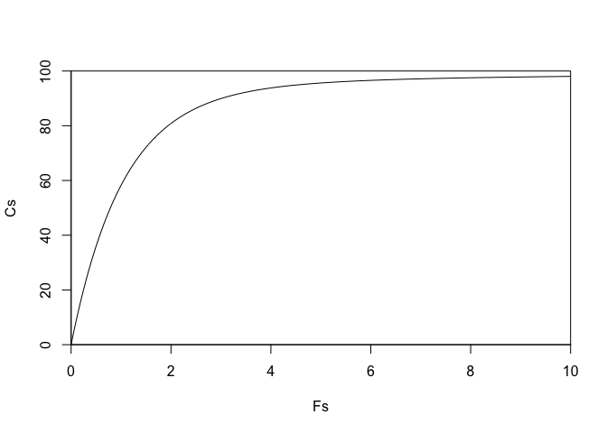
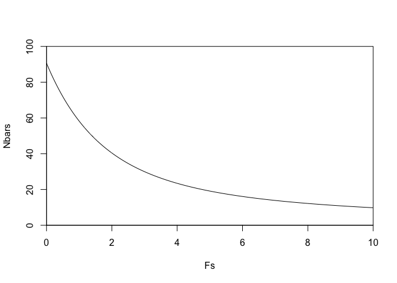
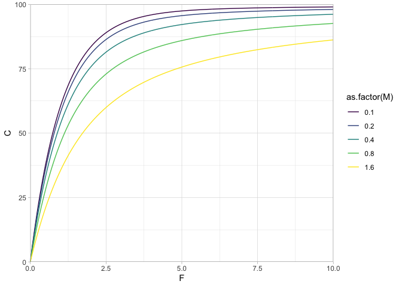

Baranov
================

``` r
library(ggplot2)
```

    ## Warning in register(): Can't find generic `scale_type` in package ggplot2 to
    ## register S3 method.

``` r
get_Nbar <- function(N0, F, M, tau = 1) {
  # Eq. 1.25
  Z <- M + F
  Nbar <- N0 * (1 - exp(-Z * tau)) / (Z * tau)
}

get_C <- function(N0, F, M = 0.2, tau = 1) {
  # Eq. 1.26/1.27
  Nbar <- get_Nbar(N0, F, M, tau)
  C <- F * Nbar * tau
  C
}
```

Demonstrate for 2 values of F:

``` r
get_C(100, F = 0.2)
```

    ## [1] 16.484

``` r
get_C(100, F = 2)
```

    ## [1] 80.83608

Illustrate over a sequence of F values:

``` r
Fs <- seq(0, 10, length.out = 500)
Cs <- purrr::map_dbl(Fs, ~ get_C(N0 = 100, F = .x))
plot(Fs, Cs, type = "l", ylim = c(0, 100), yaxs = "i", xaxs = "i")
```

<!-- -->

What do those Nbars looks like?

``` r
Nbars <- purrr::map_dbl(Fs, ~ get_Nbar(N0 = 100, F = .x, M = 0.2))
plot(Fs, Nbars, type = "l", ylim = c(0, 100), yaxs = "i", xaxs = "i")
```

<!-- -->

They decrease with higher F because F also decays (‘kills’) the number
of fish throughout the year.

Illustrate over a sequence of F values and 5 different M values:

``` r
pars <- expand.grid(F = Fs, M = c(0.1, 0.2, 0.4, 0.8, 1.6))
pars$C <- purrr::pmap_dbl(pars, get_C, N0 = 100)
ggplot(pars, aes(F, C, colour = as.factor(M))) + geom_line() +
  scale_colour_viridis_d() +
  theme_light() +
  coord_cartesian(expand = FALSE, ylim = c(0, 100))
```

<!-- -->
