Surplus production
================

Production functions:

``` r
fletcher <- function(B, Binf, m) {
  (4 * m) / Binf * (1 - B / Binf) * B
}
B <- 1:100
plot(B, sapply(1:100, function(x) fletcher(x, 100, 60)), ylab = "Production rate")
```

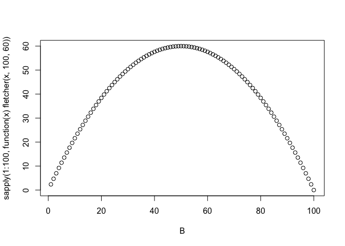<!-- -->

``` r
schaefer <- function(B, Binf, r) {
  r * (1 - B / Binf) * B
}
B <- seq(0, 100, length.out = 1000)

# find matching r:
get_r <- function(m, Binf) (4 * m) / Binf
get_r(60, 100)
#> [1] 2.4

Pdot <- sapply(B, function(x) schaefer(x, 100, 2.4))
plot(B, Pdot, type = "l", ylim = c(-10, max(Pdot)), ylab = "Rate (1/t)", xlab = "B (biomass)")
abline(h = 0)
abline(v = 100 / 2)

# Fm <- (2 * 60) / 100 # after eq 2.8c
# Fm

F <- 0.6
Ydot <- F * B
lines(B, Ydot, col = "blue")

Bstar <- B[min(which(Pdot < Ydot))]
Pdot_star <- Pdot[min(which(Pdot < Ydot))]
Fstar <- Pdot_star / Bstar # 2.4b
Fstar
#> [1] 0.5981982

Ydot_star <- Fstar * B
Bdot <- Pdot - Ydot_star
lines(B, Bdot, col = "red")
abline(v = Bstar)

legend("topleft",
  col = c("black", "blue", "red"),
  legend = c("Pdot (production rate)", "Ydot (yield rate)", "Bdot (biomass rate)"),
  lty = c(1, 1, 1)
)
```

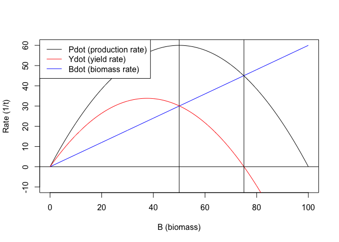<!-- -->

Simulate from a Schaefer surplus production model:

``` r
set.seed(1)
sim_schaefer <- function(K, r, q, sigma, N, C) {
  B <- numeric(N)
  U <- numeric(N)
  B[1] <- K
  U[1] <- q * B[1]
  for (i in 2:N) {
    B[i] <- B[i - 1] + r * B[i - 1] * (1 - (B[i - 1] / K)) - C[i - 1]
    U[i] <- q * B[i]
  }
  index <- exp(log(U) + rnorm(N, -(sigma^2) / 2, sigma))
  list(index = index, catch = C, B = B)
}

catches <- c(seq(0, 96, length.out = 50), seq(96, 0, length.out = 50))
sim_dat <- sim_schaefer(K = 1000, r = 0.3, q = 0.1, sigma = 0.2, N = length(catches), C = catches)
par(mfrow = c(3, 1))
plot(sim_dat$index, type = "o")
plot(sim_dat$catch, type = "o")
plot(sim_dat$B, type = "o")
```

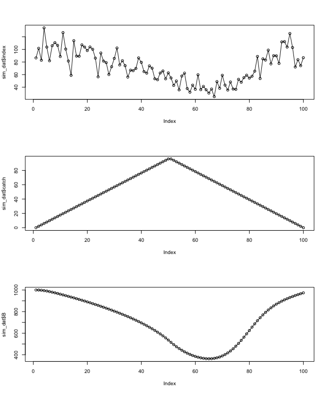<!-- -->

A function to return the negative log likelihood or predictions:

``` r
sp_nll <- function(par, dat, return_predictions = FALSE) {
  N <- dat$N
  catch <- dat$catch
  Uobs <- dat$Uobs
  
  K <- exp(par["log_K"])
  r <- exp(par["log_r"])
  q <- exp(par["log_q"])
  sigma <- exp(par["log_sigma"])
  
  B <- numeric(N)
  U <- numeric(N)
  B[1] <- dat$initial_depletion * K
  for (i in 2:N) {
    B[i] <- B[i - 1] + r * B[i - 1] * (1 - (B[i - 1] / K)) - catch[i - 1]
  }
  U <- q * B # vectors
  U[U < 0.0001] <- 0.0001
  
  nll <- 0
  # # prior on r:
  # nll <- -dnorm(log(r), log(0.3), sd = 0.3, log = TRUE)
  
  # # prior on K:
  # nll <- nll - dnorm(log(K), log(1000), sd = 0.1, log = TRUE)
  
  # observation likelihood on index:
  nll <- nll - sum(dnorm(log(U), log(Uobs) - (sigma^2) / 2, sd = sigma, log = TRUE))
  
  if (!return_predictions) {
    return(nll)
  } else {
    return(list(U = U, B = B))
  }
}
```

``` r
# create input data:
dat <- list()
dat$catch <- sim_dat$catch
dat$Uobs <- sim_dat$index
dat$N <- length(sim_dat$catch)
dat$initial_depletion <- 1

# initial values:
pars <- c(log_K = log(1000), log_r = log(0.3), log_q = log(0.1), log_sigma = log(0.2))

# test it:
sp_nll(pars, dat = dat)
#> [1] -28.70014

# fit it:
fit <- nlminb(pars, sp_nll, control = list(eval.max = 1000, iter.max = 1000), dat = dat)

par_hat <- unname(exp(fit$par))
names(par_hat) <- gsub("log_", "", names(pars))
round(par_hat, 2)
#>       K       r       q   sigma 
#> 1072.46    0.28    0.09    0.18

est <- sp_nll(fit$par, dat = dat, return_predictions = TRUE)
par(mfrow = c(2, 1))
plot(est$U, type = "l", ylab = "Index", xlab = "Year")
points(sim_dat$index)
plot(est$B, type = "l", ylab = "Biomass", xlab = "Year")
lines(sim_dat$B, lty = 2)
```

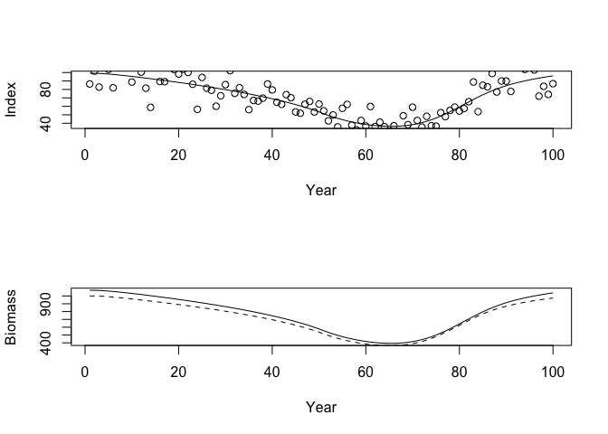<!-- -->

That was a “two-way trip” with moderately strong fishing, which is quite
informative. Try others.

First, make function to do the fitting and plotting:

``` r
fit_sp <- function(catches, K = 1000, r = 0.3, q = 0.1, sigma = 0.2, title = "") {
  sim_dat <- sim_schaefer(K = K, r = r, q = q, sigma = sigma, N = length(catches), C = catches)
  cat("True pars: K = ", K, ", r = ", r, ", q =", q, ", sigma = ", sigma, "\n", sep = "")
  par(mfrow = c(3, 1))
  plot(sim_dat$catch, type = "o", ylab = "Catch", xlab = "Year", main = title)
  
  dat <- list()
  dat$catch <- sim_dat$catch
  dat$Uobs <- sim_dat$index
  dat$N <- length(sim_dat$catch)
  dat$initial_depletion <- 1
  
  pars <- c(log_K = log(K), log_r = log(r), log_q = log(q), log_sigma = log(sigma))
  fit <- nlminb(pars, sp_nll, control = list(eval.max = 2000, iter.max = 2000), dat = dat)
  
  par_hat <- unname(exp(fit$par))
  names(par_hat) <- gsub("log_", "", names(pars))
  cat("Estimated pars:\n")
  print(round(par_hat, 2))
  
  est <- sp_nll(fit$par, dat = dat, return_predictions = TRUE)
  plot(est$U, type = "l", ylab = "Index", xlab = "Year", ylim = range(est$U, sim_dat$index))
  points(sim_dat$index)
  plot(est$B, type = "l", ylab = "Biomass", xlab = "Year", ylim = range(c(est$B, sim_dat$B)))
  legend("topleft", legend = c("True", "Estimated"), lty = c(2, 1))
  lines(sim_dat$B, lty = 2)
}
```

Two-way trip:

``` r
catches <- c(seq(0, 96, length.out = 50), seq(96, 0, length.out = 50))
fit_sp(catches, title = "One-way trip")
#> True pars: K = 1000, r = 0.3, q =0.1, sigma = 0.2
#> Estimated pars:
#>      K      r      q  sigma 
#> 928.85   0.33   0.10   0.19
```

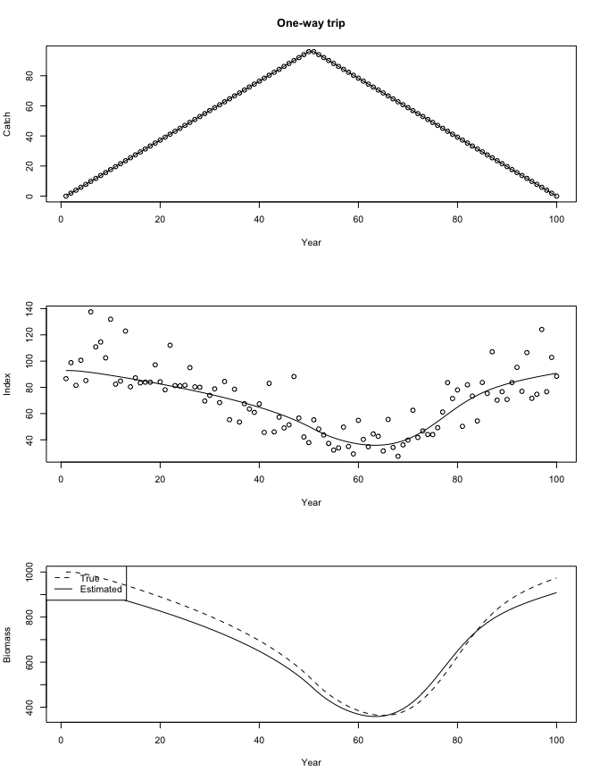<!-- -->

``` r
fit_sp(catches, title = "One-way trip")
#> True pars: K = 1000, r = 0.3, q =0.1, sigma = 0.2
#> Estimated pars:
#>      K      r      q  sigma 
#> 999.52   0.30   0.10   0.21
```

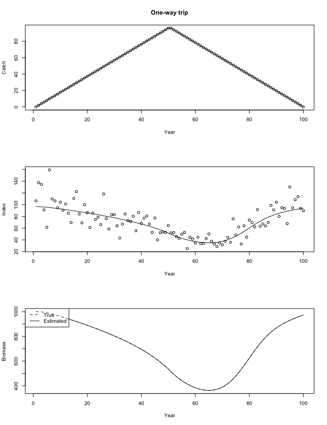<!-- -->

Lightly fished:

``` r
set.seed(123)
catches <- c(seq(0, 12, length.out = 50), seq(12, 0, length.out = 50))
fit_sp(catches, title = "Lightly fished")
#> True pars: K = 1000, r = 0.3, q =0.1, sigma = 0.2
#> Estimated pars:
#>     K     r     q sigma 
#> 99.62  1.68  1.00  0.18
```

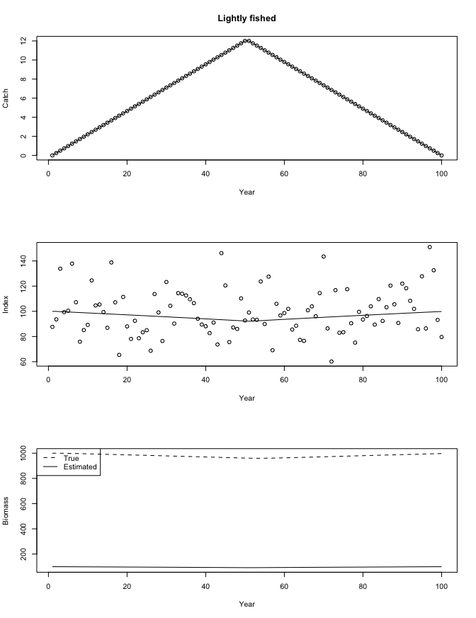<!-- -->

``` r
fit_sp(catches, title = "Lightly fished")
#> True pars: K = 1000, r = 0.3, q =0.1, sigma = 0.2
#> Estimated pars:
#>            K            r            q        sigma 
#> 4.245237e+10 1.960000e+00 0.000000e+00 1.900000e-01
```

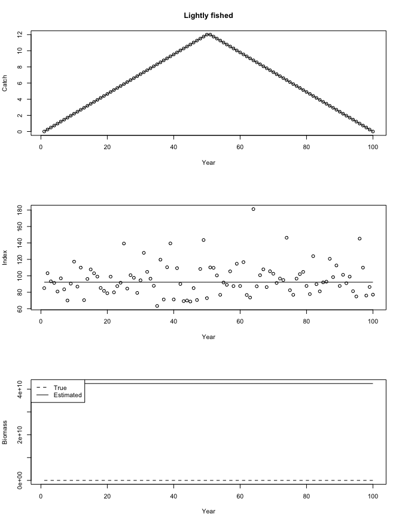<!-- -->

``` r
fit_sp(catches, title = "Lightly fished")
#> True pars: K = 1000, r = 0.3, q =0.1, sigma = 0.2
#> Estimated pars:
#>     K     r     q sigma 
#> 52.28  2.09  1.97  0.19
```

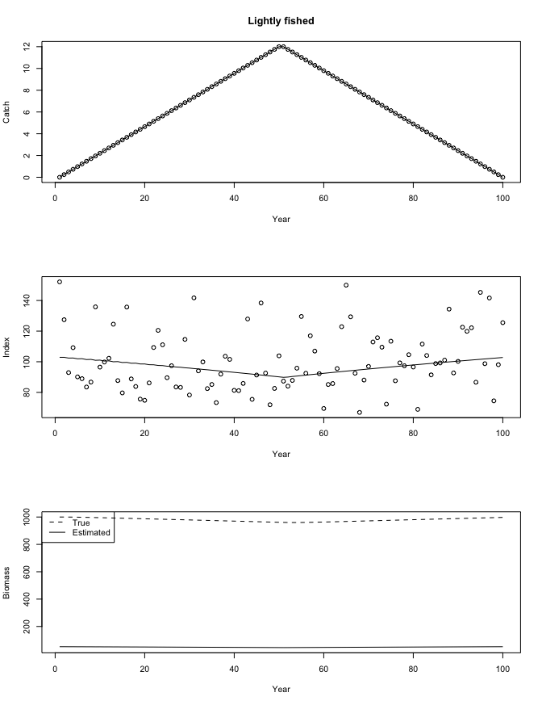<!-- -->

One-way trip:

``` r
catches <- c(seq(0, 95, length.out = 100))
fit_sp(catches, title = "One-way trip")
#> True pars: K = 1000, r = 0.3, q =0.1, sigma = 0.2
#> Estimated pars:
#>       K       r       q   sigma 
#> 1371.33    0.20    0.07    0.21
```

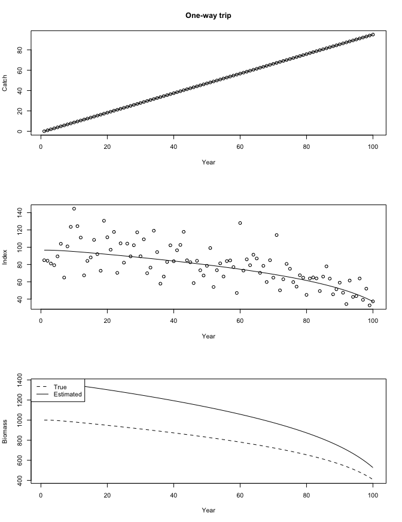<!-- -->

``` r
fit_sp(catches, title = "One-way trip")
#> True pars: K = 1000, r = 0.3, q =0.1, sigma = 0.2
#> Estimated pars:
#>      K      r      q  sigma 
#> 384.64   0.87   0.25   0.20
```

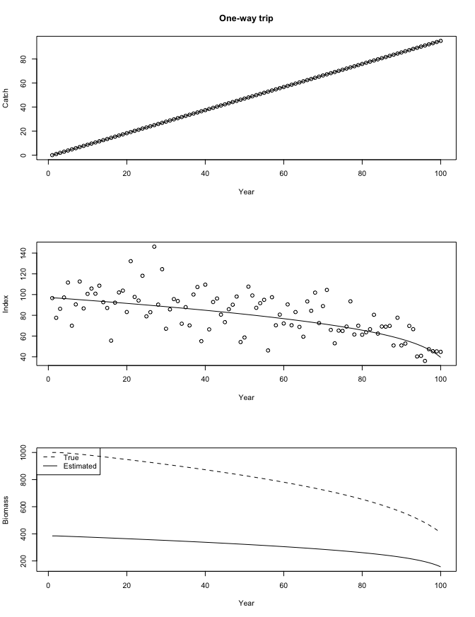<!-- -->

Initially fished hard:

``` r
catches <- c(seq(97, 0, length.out = 100))
fit_sp(catches, title = "Initially fished hard")
#> True pars: K = 1000, r = 0.3, q =0.1, sigma = 0.2
#> Estimated pars:
#>      K      r      q  sigma 
#> 890.35   0.35   0.10   0.18
```

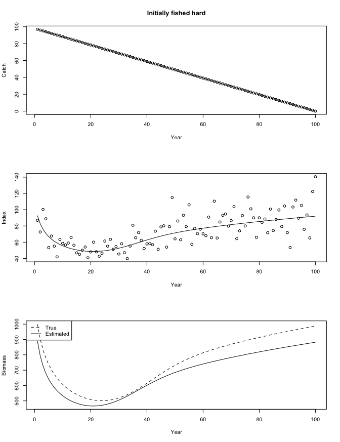<!-- -->

``` r
fit_sp(catches, title = "Initially fished hard")
#> True pars: K = 1000, r = 0.3, q =0.1, sigma = 0.2
#> Estimated pars:
#>      K      r      q  sigma 
#> 883.36   0.34   0.11   0.20
```

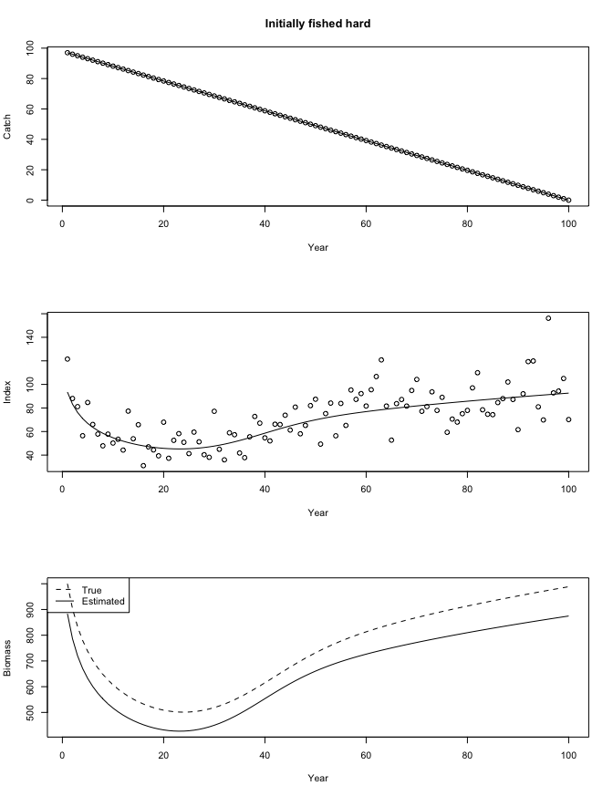<!-- -->

Roller coaster:

``` r
catches <- sin(2 * pi * seq(-1, 1, length.out = 100)) * 20 + 70
fit_sp(catches, title = "Roller coaster")
#> True pars: K = 1000, r = 0.3, q =0.1, sigma = 0.2
#> Estimated pars:
#>      K      r      q  sigma 
#> 956.92   0.31   0.11   0.20
```

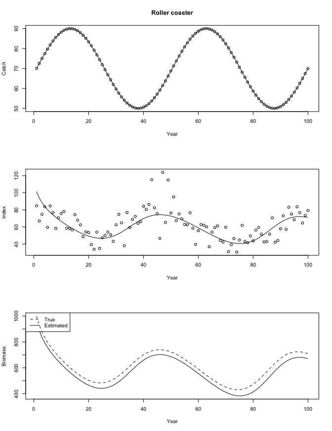<!-- -->

Roller coaster with noisy survey:

``` r
catches <- sin(2 * pi * seq(-1, 1, length.out = 100)) * 20 + 70
fit_sp(catches, title = "Roller coaster", sigma = 0.8)
#> True pars: K = 1000, r = 0.3, q =0.1, sigma = 0.8
#> Estimated pars:
#>      K      r      q  sigma 
#> 935.49   0.33   0.06   0.84
```

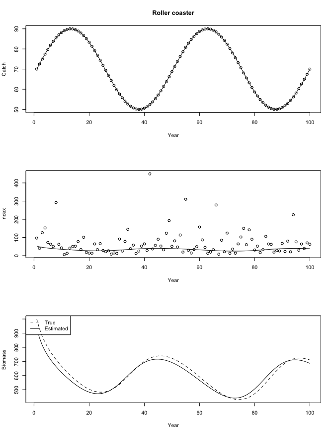<!-- -->

``` r
fit_sp(catches, title = "Roller coaster", sigma = 0.8)
#> True pars: K = 1000, r = 0.3, q =0.1, sigma = 0.8
#> Estimated pars:
#>       K       r       q   sigma 
#> 1390.63    0.20    0.04    0.81
```

<!-- -->

``` r
fit_sp(catches, title = "Roller coaster", sigma = 0.8)
#> True pars: K = 1000, r = 0.3, q =0.1, sigma = 0.8
#> Estimated pars:
#>       K       r       q   sigma 
#> 1406.48    0.20    0.04    0.82
```

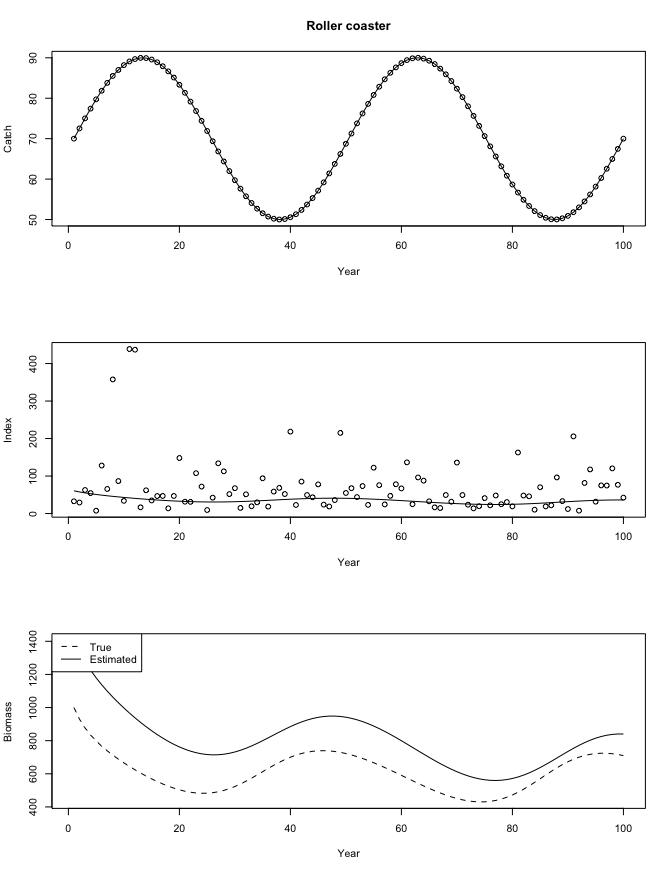<!-- -->

# Do it in Stan

``` txt
data {
  int<lower=1> N;
  vector[N] C;
  vector[N] log_Uobs;
  real<lower=0> init_depletion;
  real log_K_mean;
  real log_q_mean;
  real log_r_mean;
  real log_K_sd;
  real log_q_sd;
  real log_r_sd;
}
parameters {
  real log_K;
  real<lower=0> sigma;
  real log_q;
  real log_r;
}
transformed parameters {
  vector[N] B;
  vector[N] log_U;
  real K;
  real r;

  K = exp(log_K);
  r = exp(log_r);

  B[1] = init_depletion * K;
  for (i in 2:N) {
    B[i] = B[i - 1] + r * B[i - 1] * (1 - (B[i - 1] / K)) - C[i - 1];
    if (B[i] < 0.001) B[i] = 0.001;
  }
  log_U = log_q + log(B);
}
model {
  sigma ~ normal(0, 1);
  log_K ~ normal(log_K_mean, log_K_sd);
  log_q ~ normal(log_q_mean, log_q_sd);
  log_r ~ normal(log_r_mean, log_r_sd);
  log_Uobs ~ normal(log_U, sigma);
}
```

``` r
library(cmdstanr)

catches <- c(seq(0, 96, length.out = 50), seq(96, 0, length.out = 50))
K <- 1000
r <- 0.3
q <- 0.2
sigma <- 0.2

set.seed(1)
sim_dat <- sim_schaefer(K = K, r = r, q = q, sigma = sigma, N = length(catches), C = catches)
par(mfrow = c(1, 1))
plot(sim_dat$catch, type = "o", ylab = "Catch", xlab = "Year")

dat <- list(
  C = sim_dat$catch,
  log_Uobs = log(sim_dat$index),
  init_depletion = 1,
  log_K_mean = log(K),
  log_q_mean = log(q),
  log_r_mean = log(r),
  log_K_sd = 2,
  log_q_sd = 1,
  log_r_sd = 1,
  N = length(sim_dat$catch)
)

init <- lapply(seq_len(4), function(i) {
  list(
    log_K = rnorm(1, log(K), 0.5), sigma = rlnorm(1, log(sigma), 0.1),
    log_q = rnorm(1, log(q), 0.5), log_r = rnorm(1, log(r), 0.5)
  )
})

mod <- cmdstan_model("schaefer_log.stan")
fit <- mod$sample(
  data = dat, init = init, parallel_chains = 4L,
  iter_sampling = 2000, iter_warmup = 1000, chains = 4, seed = 123,
  adapt_delta = 0.99, max_treedepth = 15L
)
```

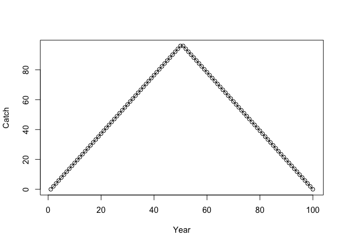<!-- -->

    #> Running MCMC with 4 parallel chains...
    #> 
    #> Chain 1 Iteration:    1 / 3000 [  0%]  (Warmup) 
    #> Chain 2 Iteration:    1 / 3000 [  0%]  (Warmup) 
    #> Chain 3 Iteration:    1 / 3000 [  0%]  (Warmup) 
    #> Chain 3 Iteration:  100 / 3000 [  3%]  (Warmup) 
    #> Chain 4 Iteration:    1 / 3000 [  0%]  (Warmup) 
    #> Chain 4 Iteration:  100 / 3000 [  3%]  (Warmup) 
    #> Chain 1 Iteration:  100 / 3000 [  3%]  (Warmup) 
    #> Chain 2 Iteration:  100 / 3000 [  3%]  (Warmup) 
    #> Chain 1 Iteration:  200 / 3000 [  6%]  (Warmup) 
    #> Chain 3 Iteration:  200 / 3000 [  6%]  (Warmup) 
    #> Chain 4 Iteration:  200 / 3000 [  6%]  (Warmup) 
    #> Chain 1 Iteration:  300 / 3000 [ 10%]  (Warmup) 
    #> Chain 2 Iteration:  200 / 3000 [  6%]  (Warmup) 
    #> Chain 4 Iteration:  300 / 3000 [ 10%]  (Warmup) 
    #> Chain 1 Iteration:  400 / 3000 [ 13%]  (Warmup) 
    #> Chain 4 Iteration:  400 / 3000 [ 13%]  (Warmup) 
    #> Chain 2 Iteration:  300 / 3000 [ 10%]  (Warmup) 
    #> Chain 3 Iteration:  300 / 3000 [ 10%]  (Warmup) 
    #> Chain 2 Iteration:  400 / 3000 [ 13%]  (Warmup) 
    #> Chain 3 Iteration:  400 / 3000 [ 13%]  (Warmup) 
    #> Chain 4 Iteration:  500 / 3000 [ 16%]  (Warmup) 
    #> Chain 1 Iteration:  500 / 3000 [ 16%]  (Warmup) 
    #> Chain 2 Iteration:  500 / 3000 [ 16%]  (Warmup) 
    #> Chain 4 Iteration:  600 / 3000 [ 20%]  (Warmup) 
    #> Chain 1 Iteration:  600 / 3000 [ 20%]  (Warmup) 
    #> Chain 2 Iteration:  600 / 3000 [ 20%]  (Warmup) 
    #> Chain 3 Iteration:  500 / 3000 [ 16%]  (Warmup) 
    #> Chain 4 Iteration:  700 / 3000 [ 23%]  (Warmup) 
    #> Chain 1 Iteration:  700 / 3000 [ 23%]  (Warmup) 
    #> Chain 2 Iteration:  700 / 3000 [ 23%]  (Warmup) 
    #> Chain 3 Iteration:  600 / 3000 [ 20%]  (Warmup) 
    #> Chain 4 Iteration:  800 / 3000 [ 26%]  (Warmup) 
    #> Chain 1 Iteration:  800 / 3000 [ 26%]  (Warmup) 
    #> Chain 2 Iteration:  800 / 3000 [ 26%]  (Warmup) 
    #> Chain 3 Iteration:  700 / 3000 [ 23%]  (Warmup) 
    #> Chain 4 Iteration:  900 / 3000 [ 30%]  (Warmup) 
    #> Chain 1 Iteration:  900 / 3000 [ 30%]  (Warmup) 
    #> Chain 2 Iteration:  900 / 3000 [ 30%]  (Warmup) 
    #> Chain 3 Iteration:  800 / 3000 [ 26%]  (Warmup) 
    #> Chain 1 Iteration: 1000 / 3000 [ 33%]  (Warmup) 
    #> Chain 1 Iteration: 1001 / 3000 [ 33%]  (Sampling) 
    #> Chain 3 Iteration:  900 / 3000 [ 30%]  (Warmup) 
    #> Chain 1 Iteration: 1100 / 3000 [ 36%]  (Sampling) 
    #> Chain 2 Iteration: 1000 / 3000 [ 33%]  (Warmup) 
    #> Chain 2 Iteration: 1001 / 3000 [ 33%]  (Sampling) 
    #> Chain 4 Iteration: 1000 / 3000 [ 33%]  (Warmup) 
    #> Chain 4 Iteration: 1001 / 3000 [ 33%]  (Sampling) 
    #> Chain 3 Iteration: 1000 / 3000 [ 33%]  (Warmup) 
    #> Chain 3 Iteration: 1001 / 3000 [ 33%]  (Sampling) 
    #> Chain 1 Iteration: 1200 / 3000 [ 40%]  (Sampling) 
    #> Chain 4 Iteration: 1100 / 3000 [ 36%]  (Sampling) 
    #> Chain 1 Iteration: 1300 / 3000 [ 43%]  (Sampling) 
    #> Chain 2 Iteration: 1100 / 3000 [ 36%]  (Sampling) 
    #> Chain 3 Iteration: 1100 / 3000 [ 36%]  (Sampling) 
    #> Chain 3 Iteration: 1200 / 3000 [ 40%]  (Sampling) 
    #> Chain 1 Iteration: 1400 / 3000 [ 46%]  (Sampling) 
    #> Chain 4 Iteration: 1200 / 3000 [ 40%]  (Sampling) 
    #> Chain 2 Iteration: 1200 / 3000 [ 40%]  (Sampling) 
    #> Chain 3 Iteration: 1300 / 3000 [ 43%]  (Sampling) 
    #> Chain 1 Iteration: 1500 / 3000 [ 50%]  (Sampling) 
    #> Chain 4 Iteration: 1300 / 3000 [ 43%]  (Sampling) 
    #> Chain 3 Iteration: 1400 / 3000 [ 46%]  (Sampling) 
    #> Chain 1 Iteration: 1600 / 3000 [ 53%]  (Sampling) 
    #> Chain 2 Iteration: 1300 / 3000 [ 43%]  (Sampling) 
    #> Chain 3 Iteration: 1500 / 3000 [ 50%]  (Sampling) 
    #> Chain 4 Iteration: 1400 / 3000 [ 46%]  (Sampling) 
    #> Chain 1 Iteration: 1700 / 3000 [ 56%]  (Sampling) 
    #> Chain 3 Iteration: 1600 / 3000 [ 53%]  (Sampling) 
    #> Chain 1 Iteration: 1800 / 3000 [ 60%]  (Sampling) 
    #> Chain 2 Iteration: 1400 / 3000 [ 46%]  (Sampling) 
    #> Chain 3 Iteration: 1700 / 3000 [ 56%]  (Sampling) 
    #> Chain 4 Iteration: 1500 / 3000 [ 50%]  (Sampling) 
    #> Chain 3 Iteration: 1800 / 3000 [ 60%]  (Sampling) 
    #> Chain 1 Iteration: 1900 / 3000 [ 63%]  (Sampling) 
    #> Chain 4 Iteration: 1600 / 3000 [ 53%]  (Sampling) 
    #> Chain 2 Iteration: 1500 / 3000 [ 50%]  (Sampling) 
    #> Chain 3 Iteration: 1900 / 3000 [ 63%]  (Sampling) 
    #> Chain 1 Iteration: 2000 / 3000 [ 66%]  (Sampling) 
    #> Chain 3 Iteration: 2000 / 3000 [ 66%]  (Sampling) 
    #> Chain 4 Iteration: 1700 / 3000 [ 56%]  (Sampling) 
    #> Chain 1 Iteration: 2100 / 3000 [ 70%]  (Sampling) 
    #> Chain 2 Iteration: 1600 / 3000 [ 53%]  (Sampling) 
    #> Chain 3 Iteration: 2100 / 3000 [ 70%]  (Sampling) 
    #> Chain 1 Iteration: 2200 / 3000 [ 73%]  (Sampling) 
    #> Chain 3 Iteration: 2200 / 3000 [ 73%]  (Sampling) 
    #> Chain 4 Iteration: 1800 / 3000 [ 60%]  (Sampling) 
    #> Chain 1 Iteration: 2300 / 3000 [ 76%]  (Sampling) 
    #> Chain 2 Iteration: 1700 / 3000 [ 56%]  (Sampling) 
    #> Chain 3 Iteration: 2300 / 3000 [ 76%]  (Sampling) 
    #> Chain 1 Iteration: 2400 / 3000 [ 80%]  (Sampling) 
    #> Chain 3 Iteration: 2400 / 3000 [ 80%]  (Sampling) 
    #> Chain 4 Iteration: 1900 / 3000 [ 63%]  (Sampling) 
    #> Chain 2 Iteration: 1800 / 3000 [ 60%]  (Sampling) 
    #> Chain 1 Iteration: 2500 / 3000 [ 83%]  (Sampling) 
    #> Chain 3 Iteration: 2500 / 3000 [ 83%]  (Sampling) 
    #> Chain 4 Iteration: 2000 / 3000 [ 66%]  (Sampling) 
    #> Chain 1 Iteration: 2600 / 3000 [ 86%]  (Sampling) 
    #> Chain 2 Iteration: 1900 / 3000 [ 63%]  (Sampling) 
    #> Chain 3 Iteration: 2600 / 3000 [ 86%]  (Sampling) 
    #> Chain 3 Iteration: 2700 / 3000 [ 90%]  (Sampling) 
    #> Chain 4 Iteration: 2100 / 3000 [ 70%]  (Sampling) 
    #> Chain 1 Iteration: 2700 / 3000 [ 90%]  (Sampling) 
    #> Chain 1 Iteration: 2800 / 3000 [ 93%]  (Sampling) 
    #> Chain 3 Iteration: 2800 / 3000 [ 93%]  (Sampling) 
    #> Chain 2 Iteration: 2000 / 3000 [ 66%]  (Sampling) 
    #> Chain 4 Iteration: 2200 / 3000 [ 73%]  (Sampling) 
    #> Chain 1 Iteration: 2900 / 3000 [ 96%]  (Sampling) 
    #> Chain 3 Iteration: 2900 / 3000 [ 96%]  (Sampling) 
    #> Chain 1 Iteration: 3000 / 3000 [100%]  (Sampling) 
    #> Chain 2 Iteration: 2100 / 3000 [ 70%]  (Sampling) 
    #> Chain 3 Iteration: 3000 / 3000 [100%]  (Sampling) 
    #> Chain 4 Iteration: 2300 / 3000 [ 76%]  (Sampling) 
    #> Chain 1 finished in 6.2 seconds.
    #> Chain 3 finished in 6.1 seconds.
    #> Chain 4 Iteration: 2400 / 3000 [ 80%]  (Sampling) 
    #> Chain 2 Iteration: 2200 / 3000 [ 73%]  (Sampling) 
    #> Chain 4 Iteration: 2500 / 3000 [ 83%]  (Sampling) 
    #> Chain 2 Iteration: 2300 / 3000 [ 76%]  (Sampling) 
    #> Chain 4 Iteration: 2600 / 3000 [ 86%]  (Sampling) 
    #> Chain 2 Iteration: 2400 / 3000 [ 80%]  (Sampling) 
    #> Chain 4 Iteration: 2700 / 3000 [ 90%]  (Sampling) 
    #> Chain 4 Iteration: 2800 / 3000 [ 93%]  (Sampling) 
    #> Chain 2 Iteration: 2500 / 3000 [ 83%]  (Sampling) 
    #> Chain 4 Iteration: 2900 / 3000 [ 96%]  (Sampling) 
    #> Chain 2 Iteration: 2600 / 3000 [ 86%]  (Sampling) 
    #> Chain 4 Iteration: 3000 / 3000 [100%]  (Sampling) 
    #> Chain 4 finished in 8.0 seconds.
    #> Chain 2 Iteration: 2700 / 3000 [ 90%]  (Sampling) 
    #> Chain 2 Iteration: 2800 / 3000 [ 93%]  (Sampling) 
    #> Chain 2 Iteration: 2900 / 3000 [ 96%]  (Sampling) 
    #> Chain 2 Iteration: 3000 / 3000 [100%]  (Sampling) 
    #> Chain 2 finished in 9.2 seconds.
    #> 
    #> All 4 chains finished successfully.
    #> Mean chain execution time: 7.4 seconds.
    #> Total execution time: 9.3 seconds.
    fit$cmdstan_diagnose()
    #> Processing csv files: /var/folders/h5/j1fmxy1n7cz6sl653t515qqr0000gn/T/RtmpaNK6B1/schaefer_log-202202101347-1-3a43e8.csv, /var/folders/h5/j1fmxy1n7cz6sl653t515qqr0000gn/T/RtmpaNK6B1/schaefer_log-202202101347-2-3a43e8.csv, /var/folders/h5/j1fmxy1n7cz6sl653t515qqr0000gn/T/RtmpaNK6B1/schaefer_log-202202101347-3-3a43e8.csv, /var/folders/h5/j1fmxy1n7cz6sl653t515qqr0000gn/T/RtmpaNK6B1/schaefer_log-202202101347-4-3a43e8.csv
    #> 
    #> Checking sampler transitions treedepth.
    #> Treedepth satisfactory for all transitions.
    #> 
    #> Checking sampler transitions for divergences.
    #> No divergent transitions found.
    #> 
    #> Checking E-BFMI - sampler transitions HMC potential energy.
    #> E-BFMI satisfactory.
    #> 
    #> Effective sample size satisfactory.
    #> 
    #> Split R-hat values satisfactory all parameters.
    #> 
    #> Processing complete, no problems detected.
    stanfit <- rstan::read_stan_csv(fit$output_files())

``` r
print(stanfit, pars = c("log_K", "log_q", "log_r", "sigma"))
#> Inference for Stan model: schaefer_log-202202101347-1-3a43e8.
#> 4 chains, each with iter=3000; warmup=1000; thin=1; 
#> post-warmup draws per chain=2000, total post-warmup draws=8000.
#> 
#>        mean se_mean   sd  2.5%   25%   50%   75% 97.5% n_eff Rhat
#> log_K  6.99       0 0.09  6.81  6.93  6.99  7.06  7.17  1609    1
#> log_q -1.69       0 0.10 -1.88 -1.76 -1.69 -1.63 -1.50  1635    1
#> log_r -1.30       0 0.11 -1.52 -1.38 -1.30 -1.23 -1.09  1620    1
#> sigma  0.18       0 0.01  0.16  0.17  0.18  0.19  0.21  2375    1
#> 
#> Samples were drawn using NUTS(diag_e) at Thu Feb 10 13:47:22 2022.
#> For each parameter, n_eff is a crude measure of effective sample size,
#> and Rhat is the potential scale reduction factor on split chains (at 
#> convergence, Rhat=1).
pairs(stanfit, pars = c("log_K", "log_q", "log_r", "sigma"))
```

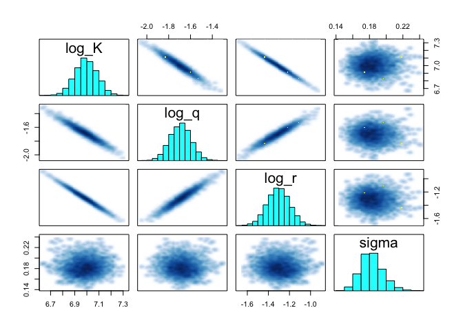<!-- -->

``` r
p <- rstan::extract(stanfit)
par(mfrow = c(2, 2))
hist(exp(p$log_K));abline(v = K, col = "red", lwd = 1.5)
hist(exp(p$log_q));abline(v = q, col = "red", lwd = 1.5)
hist(exp(p$log_r));abline(v = r, col = "red", lwd = 1.5)
hist(p$sigma);abline(v = sigma, col = "red", lwd = 1.5)
```

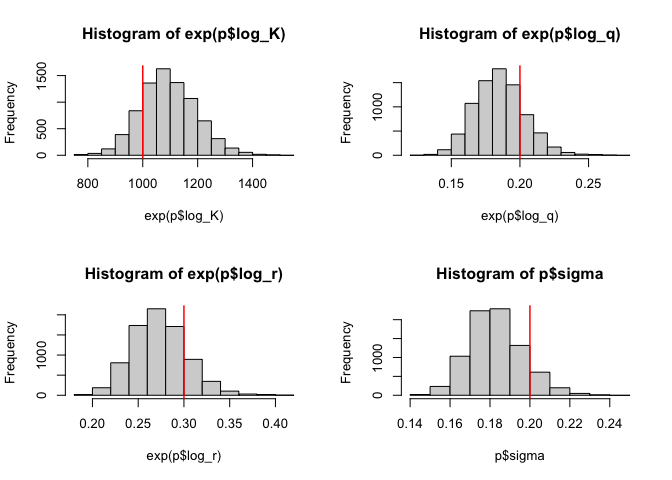<!-- -->
